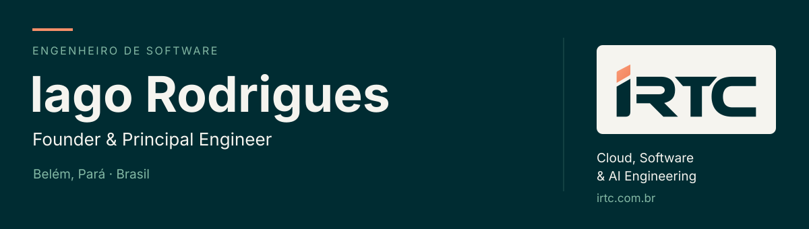

<picture>
  <source media="(max-width: 600px)" srcset="./assets/profile-header-mobile.svg">
  
</picture>

  <a href="https://irtc.com.br"><strong>IRTC</strong></a> ·
  <a href="https://www.linkedin.com/in/iago-rodrigues/">LinkedIn</a> ·
  <a href="#writing">Writing</a> ·
  <a href="#contact">Contact</a>

## About me

I'm Iago, a software engineer and the founder of [IRTC](https://irtc.com.br). I have eight years of experience building web applications, a background as a Senior Frontend Engineer, and a degree in Information Systems.

I'm based in Belém, Brazil. My work covers implementation, architecture, accessibility, and software maintenance. At IRTC, my initial focus is systems integration and business process automation. I'm also deepening my skills in AWS, software modernization, AI integrations, and agentic workflows.

## Engineering at IRTC

IRTC is a B2B engineering and technology company. Our work spans three areas:

| Area | Focus |
|---|---|
| Cloud Engineering | Architecture, infrastructure, and modernization on AWS. |
| Software Engineering | Systems integration, automation, and application development. |
| AI Engineering | AI integrations and agentic workflows, with evaluation and human review. |

I work from understanding the problem through architecture, implementation, and validation. Each project has a defined scope, dependencies, and acceptance criteria.

**[Let's talk about your project](https://irtc.com.br).**

## Technologies

I work with TypeScript, Node.js, and PostgreSQL, alongside JavaScript, Vue, and React for web applications.

`TypeScript` `Node.js` `PostgreSQL` `JavaScript` `Vue` `React` `Tailwind CSS`

I also use NestJS, Django, GraphQL, MySQL, and MongoDB. For delivery and testing: Git, GitHub Actions, Docker, and Jest.

## Writing

I write about software development on [DEV Community](https://dev.to/oiagorodrigues) and [Medium](https://medium.com/@iagokv).

## Outside work

I enjoy video games, watching movies and TV with my family, and spending time with my two cats, Juliette and Luna.

## Contact

For projects and partnerships, [visit IRTC and tell us what you're working on](https://irtc.com.br).

For professional conversations, you can find me on [LinkedIn](https://www.linkedin.com/in/iago-rodrigues/).
